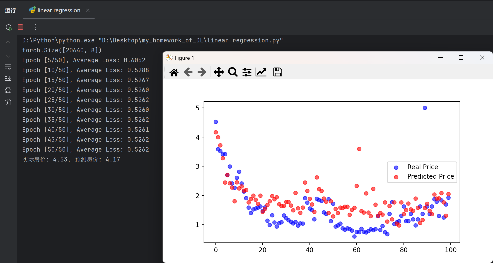

# 线性神经网络之线性回归

这里展示我的学习理解及成果，如有不正确部分请指出，谢谢。

---

## 一、线性网络在做什么

y = Xw + b

X是输入特征，w是权重，b是偏置，y是模型预测值

从零实现的过程是这样的，首先要生成数据，这里有很多官方的数据集，当然也可以自己用python函数来生成一些测试数据。然后是读取数据集，这里要小批量读取，有几个参数：

batch_size：每次送进模型多少样本；epoch：遍历一遍全部数据集；step/iteration：参数更新一次

然后第三步是初始化参数，这里需要初始化w和b，这里让我知道，模型不是从空白开始学，而是有一个起步值的。

第四步是定义模型，线性模型是最简单的，然后是定义损失函数，回归任务中常用均方误差函数，也就是MSE，公式是这样的：

$L = \frac{1}{n}\sum_{i=1}^{n} (\hat{y}_i - y_i)^2$

所以这里让我认识到，预测值和真实值差的越多，这个L就越大，这里平方会放大偏差，所以对大误差是极其敏感的。

在PyTorch中写成这样：
```python
from torch import nn
criterion = nn.MSELoss()
```

第六步是训练，大致分为前向传播、反向传播、参数更新。这里形成了一个闭环：前向传播得到预测值->计算损失->反向传播算梯度->参数更新->清空梯度进入下一轮

我觉得这里的清空梯度是比较重要的，因为如果不清空，就会梯度累加，甚至梯度爆炸。因为我在做小测试的时候犯过这个错误，导致模型根本没法收敛，loss波动剧烈，这样来清空梯度：
```python
optimizer.zero_grad()
```

它的作用是把上一轮保存在参数中的梯度清零，避免梯度不断累加。


## 二、简洁实现

下面使用PyTorch的高级API讨论简洁实现。

我们通常直接使用：
```python
nn.Linear
nn.MSELoss
torch.optim.SGD
DataLoader
```
这爽多了，不用自己费劲写复杂细节了，当然还有TensorFlow、Paddle等等，Paddle是国产的，百度研发，在我起初学习的时候，我甚至不知道PyTorch的用处，后来折腾云GPU又遇到了飞桨AI Studio，现在实打实地感受到了框架的好处。

但是这并不是省略对底层的理解，而是把理解过的东西变成成熟的API，从而省事。

# 其它

## 问题1
李沐老师的书中提到了一个问题：如果将小批量的总损失替换为小批量损失的平均值，需要如何更改学习率？

先给出结论，新学习率是老学习率的batch_size倍,batch_size是每次喂给神经网络的样本数。以下是我的理解：假如batch_size为10，即一次喂给神经网络10个样本，每个样本的损失为L1-L10，总损失是对这10个值求和，平均值是求平均，前者梯度是10个梯度的和，后者是平均梯度，所以后者的梯度是前者的1/10，即将小批量的总损失替换为小批量损失的平均值后，梯度缩小了10倍，参数更新公式：新参数＝老参数-学习率×梯度，为了保持更新幅度不变，所以新学习率是老学习率的10倍。

但是通过与ChatGPT交流，我了解到以上结论在数学上是成立的，在日常工业使用中则不然。大多数框架会默认reduction = 'mean'，即默认就是平均损失。

## 问题2

这里还有一个问题：PyTorch中常用的损失函数和初始化方法。

我从回归任务和分类任务两个方面来阐述。回归任务中用的较多的是MSE，即均方误差函数，在PyTorch中是这么实现的：
```python
from torch import nn
criterion = nn.MSELoss()
```
其次还有绝对值误差：
```python
from torch import nn
criterion = nn.L1Loss()
```
分类任务中用的比较多的是交叉熵损失函数：nn.CrossEntropyLoss()，一般用于多分类任务；比如识别10个数字，交叉熵损失会惩罚预测概率和真实标签差距大的情况；
二分类常用：nn.BCEWithLogitsLoss()，它内置Sigmoid+二元交叉熵，不会出现数值爆炸/消失。

## 一个小展示

先把代码贴在这里，然后我来详细说一下我做了什么：

```python
import torch
import torch.nn as nn
from torch.utils.data import DataLoader,TensorDataset
from sklearn.datasets import fetch_california_housing
from sklearn.preprocessing import StandardScaler #标准化
import matplotlib.pyplot as plt
'''如果不正则化，房屋年龄可能是30几，家庭收入中位数可能是10几，总房间可能有100间，
模型会以为这个100比10就重要'''

data = fetch_california_housing()
X_raw = data.data
y_raw = data.target

#标准化
scaler = StandardScaler()
X_scaled = scaler.fit_transform(X_raw)

X = torch.tensor(X_scaled, dtype=torch.float32)
y = torch.tensor(y_raw, dtype=torch.float32).reshape(-1,1)

dataset = TensorDataset(X,y)
train_loader = DataLoader(dataset,batch_size=32,shuffle=True)

print(X.shape)#这里输出了20640个样本，8个特征，所以说接下来的输入特征为8
model = nn.Sequential(nn.Linear(8,1))

#损失函数
loss = nn.MSELoss()

#优化器
optimizer = torch.optim.Adam(model.parameters(),lr = 0.001)

epochs = 50
for epoch in range(epochs):
    epoch_loss = 0.0
    for X_batch,y_batch in train_loader:
        y_pred = model(X_batch)
        loss_1 = loss(y_pred,y_batch)

        optimizer.zero_grad()#梯度清零，很重要
        loss_1.backward()
        optimizer.step()

        epoch_loss += loss_1.item()#保护内存

    avg_loss = epoch_loss / len(train_loader)
    print(f"Epoch [{epoch + 1}/{epochs}], Average Loss: {avg_loss:.4f}")

test = 0
with torch.no_grad():
    pred = model(X[test])
    print(f"实际房价: {y[test].item():.2f}, 预测房价: {pred.item():.2f}")

model.eval() # 将模型设为评估模式
with torch.no_grad():
    # 取出前100个样本进行对比
    y_preds = model(X[:100]).numpy()
    y_trues = y[:100].numpy()

plt.figure(figsize=(10, 6))
plt.scatter(range(100), y_trues, color='blue', label='Real Price', alpha=0.6)
plt.scatter(range(100), y_preds, color='red', label='Predicted Price', alpha=0.6)
plt.title("")
plt.legend()
plt.show()
```
这是一个预测房价的线性回归模型，数据集是加载的加州房价数据。然后这里的大部分代码都是手写的，当然中间也出现了很多问题，最后的matplotlib是让Gemini帮我完成的，因为这很直观。

这里贴出运行结果：

我为了粘这张图片，在输出那里加上了每隔5轮打印一次的代码，粗略地看，预测效果还是可以的，但是我折腾了不少时间，一开始我用的优化器是SGD（随机梯度下降），在打印训练数据的时候由于代码缩进出现了问题，导致梯度爆炸了：
```markdown
实际房价: 4.53, 预测房价: 43578348797952.00
```
然后修复了代码问题后，我换为了Adam（自适应矩估计）优化器，发现训练结果并没有大提升，借助AI了解了一下，原因如下：

数据量有20000多条，而参数很少，数据管够，模型极简，有一种拿着大炮打蚊子的感觉。

Adam可以自己调学习率，自适应；而SGD中所有参数都用同一个学习率。比如下山，SGD是你让我一步走1m，那我就一直一步走1m，所以缓的地方太慢了，陡坡还容易摔。而Adam好就好在可以自适应，我觉得陡了我就走慢点，我觉得缓了我就走快点。所以Adam更容易收敛，不容易爆炸。

但是Adam并不一定就比SGD好，这里不详细说了，两者是看场景使用的，没有孰是孰非的概念。

## 小结

上面提及的是线性神经网络中的线性回归部分，回归和分类是线性神经网络的两大任务，后面会展示讨论softmax回归。这是我的个人学习心得，并不是系统地阐述知识，所以当你阅读的时候，要结合有关书籍来理解内容。